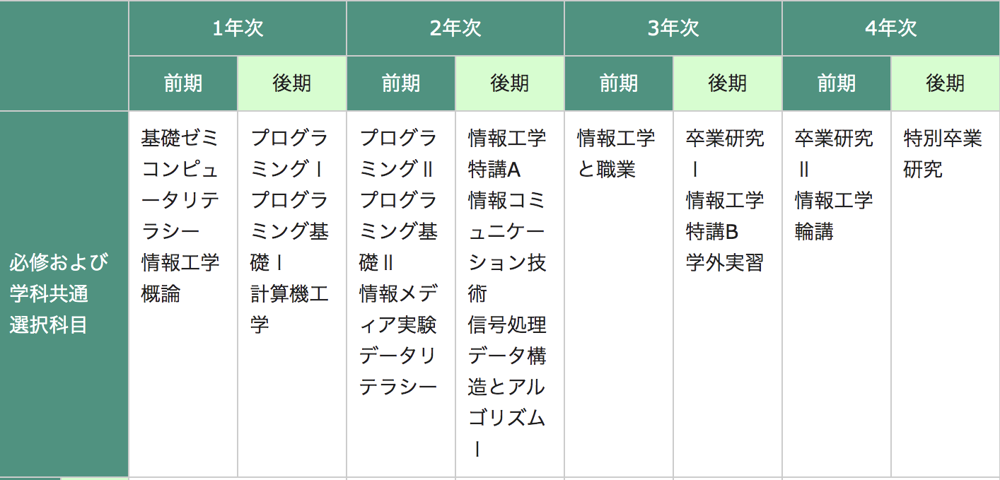

# 情報工学科の紹介
<!-- Markdown記法を使って学科の紹介ページを作る -->
## 1.紹介😄
_コンピュータの基礎から、高度なプログラミングまで。_
_情報化社会をさらに進化させる、IT業界の新たなリーダーを育成。_ 
## ２.３つのコース
*･システムエンジニアリングコース*
*･インターネット＆セキュリティコース*
*･知能情報コース* 
## 3.到達目標

ア.教養・基礎学力の修得 | イ.専門知識・技術の修得
--------------------|------------------  
ウ.コミュニケーション能力の修得 |エ.総合課題解決能力の修得

・URL
[拓殖大学](https://www.takushoku-u.ac.jp/summary/)

<!-- この部分より上に記述を追加して下のチェックボックスで確認する -->
- [x] 2種類以上の見出し(headers)を使っている．
- [x] 2種類以上の強調(emphasis)を使っている．
- [x] (番号付きの)リスト(ordered lists)を使っている
- [x] (番号無しの)リスト(unordered lists)を使っている．
- [x] 1つ以上の画像(images)を使っている．
- [x] 1つ以上のリンク(links)を使っている．
- [x] 1つ以上の表(tables)を使っている．
- [x] 1つ以上の絵文字を使っている．
